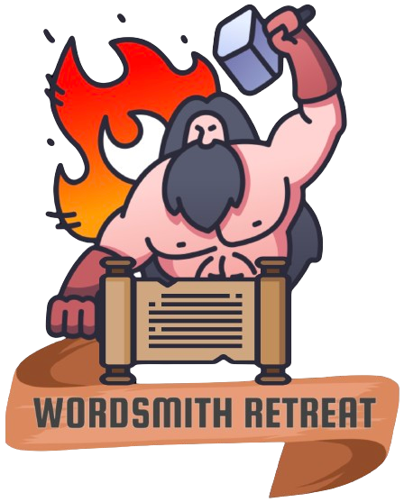

# Wordsmith Retreat - Personal Library

React project focused on developing an app to be used as a personal bookmark library for the user. Its main features consist on:
* Multiple pages with a navigational feature to connect them.
* Relational database connection using Supabase platform.
* Searchbar.
* Bookmark.
* Add and delete items.
* Modal displays.

## Technologies

Main technologies used:

- [React](https://react.dev/) - JS Front-End library.
    - [Javascript](https://www.javascript.com/) - Application functionalities.
    - HTML -- Application content structure.
    - CSS -- Application content styling.   
- [Supabase](https://supabase.com/) - Used to store the data this application is feed on.
- [Netlify](https://www.netlify.com/) - Used to deploy the application.

## Usage

This app is to be used by people as a personal bookmark page to find, add or edit exisiting items and check additional information in order to ultimately purchase a book copy.

## Authors

- Alvaro Sarria Rico
    - [Github](https://github.com/alvsarria)
    - [Linkedin](https://www.linkedin.com/in/alsarria90/)

## Version History

- 0.2 
    - Various bug fixes and optimizations.
    - See [commit changes](https://github.com/alvsarria/project2/commits/main/).
- 0.1 
    - Initial release.

## Acknowledgments

Mentoring, inspiration and great support:
- Marcel Bosch Espín
- Nisol Medina Perozo
- Mikel Jimenez Calcedo
- Lee Kiowa Roy Fiala Grau
- Arnaldo Mera Rojas

